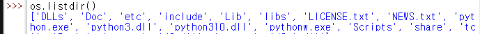
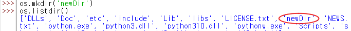
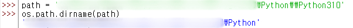
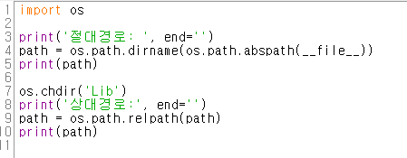

# [python] os모듈

- [os 모듈이란?](#🔸os모듈)
- [os의 메서드](#🔸os의-메서드)
    + getcwd()
    + listdir()
    + mkdir()
    + rmdir()
    + chdir()
- [os.path의 메서드](#🔸ospath)
    + .dirname()
    + .abspath()
    + .relpath()

## 🔸os모듈
: Operating System의 약자. 운영체제에서 제공하는 여러 가능을 파이썬에서 수행할 수 있게 해준다.

메서드 이름이 `C언어 시스템 콜`과 매우 유사해 보인다. 그 중 디렉토리, 파일 경로와 관련된 몇 가지 메서드만 보도록 하자.

## 🔸os의 메서드
* getcwd() 
    
    : 현재 경로를 반환한다.

    
    
    사용 예시는 위와 같다. os의 메서드를 사용하려면 import를 해줘야 하고, idle에서 경로 변경 없이 사용하니 현재 경로는 `Python310`로 출력이 된다.
* listdir() 
    
    : 특정 디렉토리 내에 있는 파일, 디렉토리 목록을 리스트로 반환한다.
     
     파라미터에 아무것도 입력하지 않으면 현재 디렉토리의 목록을 반환한다.

     

     getcwd() 예시와 동일한 경로에서 사용하니 `Python310` 디렉토리에 있는 파일과 디렉토리가 리스트 형태로 출력되었다.

* mkdir() 

    : 파라미터에 입력한 이름의 디렉토리를 생성한다.

    

    경로 변경 없이 `newDir`라는 디렉토리를 생성하고 `listdir()`를 한 결과, 만든 디렉토리가 리스트에 포함된 것을 볼 수 있다.
* rmdir()

    : 파라미터에 입력한 이름의 빈 디렉토리를 제거한다.

    

    방금 생성한 `newDir`를 지워 보았다. 제거 되었기 때문에 `listdir()` 결과에서 보이지 않는다.

* chdir()
  
    : 파라미터에 입력한 경로로 현재 경로를 변경한다.

    

    `Python310` 디렉토리에 있는 `Lib` 디렉토리로 경로를 옮겼다. 그 다음에 `getcwd()`를 해보면, 현재 경로가 `Lib`인 것을 알 수 있다.

## 🔸os.path

 : 파일 경로에 대한 다양한 함수를 모아둔 모듈이다. ~~os 모듈을 찾아보게 된 계기이기도 하다.~~

* .dirname()
  
  : 파라미터로 들어온 경로가 있는 디렉토리명을 반환한다.

  

  path라는 변수에 `Python310`의 경로를 저장한 다음 `path.dirname()`를 한 결과, `Python310`의 상위 경로인 `Python`의 경로가 출력되었다.

* .abspath()
    
  : 파라미터로 들어온 경로의 절대 주소를 반환한다. 
* .relpath()
 
  : 파라미터로 들어온 경로의 상대 주소를 반환한다.

  
  

  `abspath()` 결과를 `dirname()`에 넣어버리긴 했지만, 위와 같은 실행 결과가 나왔다.

  여기서 `__file__`은 이 `.py`파일의 위치를 나타낸다.(~~이걸 확인해보기 위해 쉘 창에서 진행하던 중에 새로 파일을 만들었다.~~)

  이 파일이 위치하는 절대 경로가 위에 출력이 되었고, 상대 경로는 `Lib` 디렉토리에서 `path`에 대한 상대 경로를 확인했다. 그 결과, `path`는 `Lib`의 상위 디렉토리이기 때문에 이를 나타내는 `..`이 출력됐다.

 

---

 

f1tenth의 코드를 살펴보던 도중, os모듈에 대한 의문이 들어 짧게나마 정리를 해보았다. 위에서 언급하였듯, C언어의 시스템 콜과 유사점이 많아 반가웠다. 시스템 콜도 잊어버리기 전에 정리를 해야겠다.