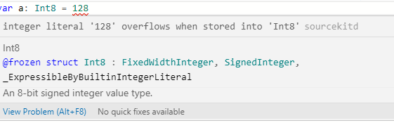

# [swift] 자료형

- [변수 & 상수](#🔸-변수variable와-상수constant) <nbsp>
- [타입 추론](#🔸-타입-추론type-inference)
- [타입 별칭](#🔸-타입-별칭typealias)
- [정수형](#🔸-정수형int-uint)
- [실수형](#🔸-실수형float-double)

<br/>

## 🔸 변수(variable)와 상수(constant)

 변수는 선언 후 데이터의 값을 변경할 수 있고, 상수는 선언하고 나면 값을 변경할 수 없는데, swift에서 변수를 선언할 때 `var`를, 상수를 선언할 때 `let`을 앞에 붙여준다.
 ```
// 변수
var 변수명: 자료형 = 값
var 변수명 = 값

// 상수
let 상수명: 자료형 = 값
let 상수명 = 값
```
<br/>

## 🔸 타입 추론(type inference)

swift는 컴파일 언어이기 때문에 **변수, 상수의 자료형을 선언 할 때 명시** 해주어야 한다. 그런데 위에서 변수와 상수를 선언하는 내용을 보면 __자료형 기입 없이 선언__ 하는 모습이 나와있다. 이러면 컴파일 에러가 나지 않을까 싶지만, swift는 `타입 추론`이 가능하다. 컴파일러가 값을 보고 그 변수/상수의 자료형을 추론하는 것이다.

```
var 변수명              // [에러] 변수 선언에서 자료형 명시 X, 값이 없어 타입 추론 불가
var 변수명: 자료형       // 변수 선언 과정에서 자료형 명시 O ( = (C에서) int a;)
var 변수명: 자료형 = 값  // 변수 선언 과정에서 자료형,값 명시 O ( = (C에서) int a = 3;)
var 변수명 = 값         // 변수 선언에서 자료형 명시 X, 값이 있어 타입 추론 가능
```

자료형을 쓰지 않고 값도 기입해주지 않았다면, 위에 나와있는대로 <span style="color:#dd4444">에러</span>가 발생하게 된다 (어떻게든 자료형을 알 수 있도록 해야한다).

또한, 자료형을 명시하는 것이 **디버깅할 때 좋고**, **컴파일 시간을 줄일 수 있다**는 장점이 있으며, 값에 따라 **타입 추론이 원하는대로 이뤄지지 않거나 불가능한 경우**가 있기 때문에 되도록 <u>자료형을 명시해주는 게 좋다</u>.

<br/>

## 🔸 타입 별칭(typealias)

타입 별칭은 C언어의 `typedef()`같은 기능으로, 자료형에 대한 별칭(alias)을 생성한다.
```
typealias MyInt = Int               // Int형에 대한 alias 'MyInt' 생성
typealias DicStrInt = Dictionary<String, Int>   //  Dictionary<String, Int>형의 별칭 'DicStrInt' 생성
```
`typealias`는 결국 자료형을 나타내기 때문에 자료형 명명법에 따라 `대문자 카멜 케이스`(대문자로 시작하는 카멜 케이스)로 표기한다.

<br/>

## 🔸 정수형(Int, UInt)

- Int: 부호가 있는 정수 표현
- UInt: 부호가 없는 정수 표현(C언어의 unsigned int 같은 자료형)

|자료형|설명|표현 범위|
|---|:---:|:---:|
|**Int**|- 32bit CPU에서 Int32와 동일|-2^31 ~ 2^31-1|
|| - 64bit CPU에서 Int64와 동일|-2^63 ~ 2^63-1|
|Int8|- 1byte(8bit)로 정수 표현|-2^7 ~ 2^7-1|
|Int16|- 2byte(16bit)로 정수 표현|-2^15 ~ 2^15-1|
|Int32|- 4byte(32bit)로 정수 표현|-2^31 ~ 2^31-1|
|Int64|- 8byte(64bit)로 정수 표현|-2^63 ~ 2^63-1|
|**UInt**|- 32bit CPU에서 UInt32와 동일| 0 ~ 2^32-1|
||- 64bit CPU에서 UInt64와 동일|0 ~ 2^64-1|
|UInt8|- 1byte(8bit)로 부호 없는 정수 표현|0 ~ 2^8-1|
|UInt16|- 2byte(16bit)로 부호 없는 정수 표현|0 ~ 2^16-1|
|UInt32|- 4byte(32bit)로 부호 없는 정수 표현|0 ~ 2^32-1|
|UInt64|- 8byte(64bit)로 부호 없는 정수 표현|0 ~ 2^64-1|

<br/>

각 정수 자료형의 표현 범위는 위와 같다. 왜 __표현 범위__ 에서 Int(signed)형의 최댓값에 `-1`이 붙었는가 하면, `0`이 들어갔기 때문이라고 보면 된다.
> ex) 2bit ▶️ -2^1 ~ 2^1-1 ▶️ [-2, -1, 0, 1]

표현 범위를 넘어가는 값을 넣으면 오버플로우가 발생하게 되는데, 직접 코드에 입력해보니 실행 전에 미리 알려준다. ~~(친절하다)~~



사진에 나와있듯 Int8형 변수는 `128`을 값으로 갖지 못하는데, '이런 128도 표현하지 못하는 자료형을 왜 쓰냐!(~~실제로 들은 말~~)'하면, 메모리 효율을 위해서다... 큰 값이 필요하지 않으면 범위가 작은 자료형을 써서 메모리를 아끼도록 하자.

자료형의 최댓값, 최솟값을 확인하는 방법이 있다.
```swift
print("Int.min: \(Int.min), Int.max: \(Int.max)") // Int.min: -9223372036854775808, Int.max: 9223372036854775807
print("UInt.min: \(UInt.min), UInt.max: \(UInt.max)") // UInt.min: 0, UInt.max: 18446744073709551615
```
`자료형.min`을 사용하면 해당 자료형의 최솟값을, `자료형.max`를 사용하면 해당 자료형의 최댓값을 알 수 있다. 64bit 환경에서 실행했더니 주석 내용과 같은 결과가 나왔다.

추가로, 문자열 안에 변수 값을 넣고 싶으면 `\(변수명)` 형식으로 써주면 된다.

진수에 따른 접두어는 아래와 같다.
```swift
var decimalInt: Int = 28            // 10진수 28
var binaryInt: Int = 0b11100        // 2진수로 28(10) 표현.
var octalInt: Int = 0o34            // 8진수로 28(10) 표현.
var hexadeciamlInt: Int = 0x1C      // 16진수로 28(10) 표현.
```

<br/>

## 🔸 실수형(Float, Double)

 - Float:
    * 4byte 실수 표현
    * e(exponent)로 표현된 실수에서 7(6)자리까지 정확히 표현한다.
    * Double에 비해 메모리를 적게 사용하기 때문에 비교적 속도가 빠르고, 정밀도가 낮다.
 - Double:
    * 8byte 실수 표현
    * e(exponent)로 표현된 실수에서 16(15)자리까지 정확히 표현한다.
    * Float보다 느리고, 정밀도가 높다.

e(exponent)를 이용한 실수 표현은 아래와 같다.
```
1230 = 1.23e3 = 1.23e+3 = 1.23 * 10^3
0.0012345 = 1.2345e-3 = 1.2345 * 10^-3
```

Float와 Double의 정밀도 차이를 보도록 하자.

```swift
var floatNum: Float = 12345678901234567890.1  // 1.2345679e+19
var doubleNum: Double = 12345678901234567890.1  // 1.2345678901234567e+19
```

각각 6자리, 15자리까지 정확하게 표현된다고 들었는데, 실제로 확인해보니 7자리/16자리까지 출력이 되었다. swift 버전마다 차이가 있는 것 같다.

</br>

---

<br/>

iOS 프로그래밍 수업을 들으면서 배운 swift의 자료형에 대해 정리를 해보았다. 뒤에 문자, 문자열,  Any, 튜플 등 많은 자료형이 남아있지만 일단 여기서 한 번 끊도록 하겠다. 

어느정도 문법에 적응하고, 입력 함수를 배우고 나면, swift로 백준 문제를 풀어보고 싶다.