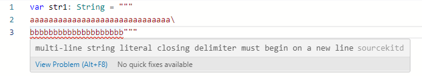
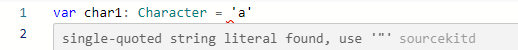

# [swift] 자료형(2)
- [문자열(String)](#🔸-문자열string)
  + [특징](#문자열의-특징)
  + [관련 함수(append, has__fix, uppercased ...)](#문자열-관련-함수)
- [문자(Character)](#🔸-문자character)
  + [탈출문자(escape character)](#탈출문자escape-character)
  + [주의사항](#주의사항)

## 🔸 문자열(String)

문자열 선언 방식도 형식 그대로다.
``` swift
    var str: String = "aaa";
    var str2: String
    str2 = "bbb";
    var str3 = "ccc"; // String 형으로 타입추론
    var str4: String = String(); // '자료형()'으로 쓰면 빈 자료형(문자열) 생성 가능.
```
<hr>

### 문자열의 특징

swift에서 String의 특징은 다음과 같다.
 - (위에서 다뤘듯) `String()`으로 생성 하면 빈 문자열로 만들 수 있다.
 - 문자열 안에 변수나 상수 값을 넣을 때는 문자열 안에 `\(변수 또는 상수)`로 표기한다.
 - `+` 를 통해 문자열을 결합할 수 있다. (~~strcat을 안써도 된다니...~~)
 - 여러 줄의 문자열을 표현할 때는 큰따옴표 3개 `"""`를 사용한다.
 - 문자열이 길어서 에디터 상에서만 줄바꿈을 할 때는 문자열 사이 백 슬래시 ` \ `를 사용한다.

<br/>
위 내용 몇 가지를 한 번 확인해 보자.



 여러 줄 문자열을 만들 때 큰 따옴표 3개를 입력하고 줄을 바꿔줘야 한다. (~~안 바꾸면 이렇게 경고 띄운다.~~)

<br/>
<코드>

``` swift
var str1: String = """
aaaaaaaaaaaaaaaaaaaaaaaaaaaaaa\
bbbbbbbbbbbbbbbbbbbb\
cccccccccccccccccccccccc
"""
var str2: String = String();

print(str1)
print(str1.isEmpty)

print(str2)
print(str2.isEmpty)
```
위처럼 코드를 입력했고, `str1`은 여러 줄처럼 보이지만, 내용이 모두 한 줄로 출력될 것이다. 그리고 `str2`는 빈 문자열로 생성했기 때문에 `isEmpty`를 했을 때 참이 나와야 한다.(~~isEmpty에 관해선 아래에서 다루겠지만, 비었는지 확인하는 함수다.~~)

<실행결과>

```
aaaaaaaaaaaaaaaaaaaaaaaaaaaaaabbbbbbbbbbbbbbbbbbbbcccccccccccccccccccccccc
false
true

```
`str2`는 빈 문자열이기 때문에 아무것도 출력이 안 된 것이다.

<hr>

### 문자열 관련 함수

그리고 문자열 자료형은 파이썬처럼 관련 함수가 몇 가지 있는데, 한 번 살펴보도록 하자.
<br/>

<코드>
``` swift
str1.append("dddddddd") // 문자열 뒤에 내용을 추가한다.
print("str1: \(str1)\nstr2: \(str2)")

str2 = str1 + "eeeeeeeee"; // str1과 "eeeeeeeee"를 결합.
print("str1: \(str1)\nstr2: \(str2)")

print("## 글자 수 확인 ##")
print("str1은 \(str1.count)글자, str2는 \(str2.count)글자이다.") // 글자 수 확인(공백포함)

print("## 빈 문자열인지 확인 ##")
print(str1.isEmpty) // 비었는지 확인
print(str2.isEmpty) // 비었는지 확인2

print("## 접두어, 접미어 확인 ##")
print(str1.hasPrefix("aa")) // str1이 "aa"로 시작하는가.
print(str2.hasPrefix("bb")) // str2가 "bb"로 시작하는가.
print(str1.hasSuffix("eeee")) // str1이 "eeee"로 끝나는가.
print(str2.hasSuffix("eeee")) // str2가 "eeee"로 끝나는가.

print("## 대/소문자 변경 ##")
str1 = str1.uppercased() // 소문자를 모두 대문자로.
print(str1)
str1 = str1.lowercased() // 대문자를 모두 소문자로.
print(str1)
```

<실행결과>
```
str1: aaaaaaaaaaaaaaaaaaaaaaaaaaaaaabbbbbbbbbbbbbbbbbbbbccccccccccccccccccccccccdddddddd
str2: 
str1: aaaaaaaaaaaaaaaaaaaaaaaaaaaaaabbbbbbbbbbbbbbbbbbbbccccccccccccccccccccccccdddddddd
str2: aaaaaaaaaaaaaaaaaaaaaaaaaaaaaabbbbbbbbbbbbbbbbbbbbccccccccccccccccccccccccddddddddeeeeeeeee
## 글자 수 확인 ##
str1은 82글자, str2는 91글자이다.
## 빈 문자열인지 확인 ##
false
false
## 접두어, 접미어 확인 ##
true
false
false
true
## 대/소문자 변경 ##
AAAAAAAAAAAAAAAAAAAAAAAAAAAAAABBBBBBBBBBBBBBBBBBBBCCCCCCCCCCCCCCCCCCCCCCCCDDDDDDDD
aaaaaaaaaaaaaaaaaaaaaaaaaaaaaabbbbbbbbbbbbbbbbbbbbccccccccccccccccccccccccdddddddd
```

## 🔸 문자(Character)
하나의 문자를 큰따옴표 `"`로 표현한다.

### 탈출문자(escape character)
|탈출문자|설명|
|:---:|:---|
|\n|줄 바꿈(개행)|
| \ \ |문자열 내에서 백슬래시( \ ) 표현|
|\ "|문자열 내에서 큰따옴표(") 표현|
|\t|탭문자(tab) 표현|
|\0|null문자(문자열의 끝) 표현|

`\` 와 `"`를 표현할 때 __띄어쓰기를 하는 게 아니다__. 마크다운에서도 탈출문자가 적용되어 어쩔 수 없이 가운데에 공백 문자를 넣은 것 뿐이다...😥

그리고, 여러 줄 문자열에서는 `\"`을 쓰지 않고 `"`만 써도 따옴표가 출력되는 것 같다.
<hr>

### 주의사항

문자형을 선언할 때 주의할 점은, 타입추론을 시킬 경우 Character가 아닌 `String`으로 추론된다는 점이다. Character형으로 추론되지 않기 때문에 참고하자.

<코드>
``` swift
var char1: Character = "a"
var char2 = "b"

print("char1: \(char1)")
print("type:", type(of:char1))

print("char2: \(char2)")
print("type: \(type(of:char2))")
```
<실행결과>
```
char1: a
type: Character
char2: b
type: String
```

또한, 위에도 적혀있지만 선언 시 큰따옴표 `"`를 사용해야 한다(!!).



(~~이것도 경고문구 뜨기 때문에...~~)
